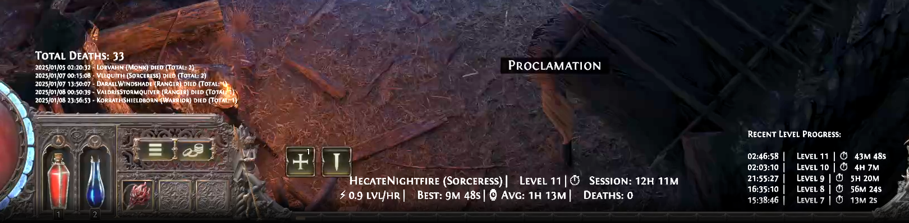

# POE2 Death Tracker

A death and leveling tracker for Path of Exile 2. This tool monitors your game logs and tracks your character deaths and level progression. Perfect for streamers who want to display death counts and level progression on their stream!



> 💡 **Font Setup**: For the authentic Path of Exile 2 look (as shown in the image above), use [Fontin SmallCaps](https://www.exljbris.com/fontin.html) in your OBS text sources. This is the official font used in-game for UI elements.

[](https://ko-fi.com/B0B71865NT)

## Quick Start (For Streamers & Users)

1. Install [Node.js](https://nodejs.org/) (v18 or higher)
2. Download this repository as ZIP (green "Code" button above)
3. Extract the ZIP file
4. Open a terminal/command prompt in the extracted folder
5. Run these commands:
   ```bash
   npm install
   npm start
   ```
6. The tracker will automatically try to find your Path of Exile 2 installation
   - Supports both Steam and Standalone installations
   - If not found, you'll be prompted to enter the path manually

### Output Files

The tracker creates a `death-stats` folder in your current directory containing:

#### Basic Stats

- `stats.json` - Complete tracking data
- `total_deaths.txt` - Total death count across all characters
- `character_stats.json` - Detailed JSON stats for all characters
- `recent_deaths.txt` - Log of all deaths
- `last_five_deaths.txt` - Most recent 5 deaths

#### Current Character Stats

- `current_character.json` - Full JSON stats for current character
- `current_character_recent_levels.txt` - Recent level progression (horizontal)
- `current_character_all_levels.txt` - All levels in compact format
- `current_character_all_levels_vertical.txt` - All levels in vertical format
- `current_character_records.txt` - Speed records and averages
- `current_character_session.txt` - Current session statistics
- `current_character_basic1.txt` through `basic4.txt` - Simple stats formats
- `current_character_recent_levels_vertical.txt` - Recent levels (vertical)

### Using with OBS

1. Add a "Text (GDI+)" source to your scene
2. Check "Read from file"
3. Browse to the `death-stats` folder in your tracker directory
4. Select any of the .txt files above
5. Style the text as needed in OBS

### Command Line Options

```bash
# Start with specific paths
npm start -- --path "path/to/Client.txt" --output "path/to/output"

# Reset configuration
npm start -- --reset-config
```

### Configuration

The tracker saves your configuration in `config/config.json`. To change settings:

1. Run with `--reset-config` flag
2. Or manually edit the config file
3. Or use command line arguments (see above)

## For Developers

### Prerequisites

- Node.js (v18 or higher)
- pnpm (or npm/yarn)

### Development Setup

```bash
git clone https://github.com/yourusername/poe2-death-tracker.git
cd poe2-death-tracker
pnpm install
```

### Running in Development Mode

```bash
pnpm dev
```

### Building for Production

```bash
pnpm build
pnpm start:prod
```
